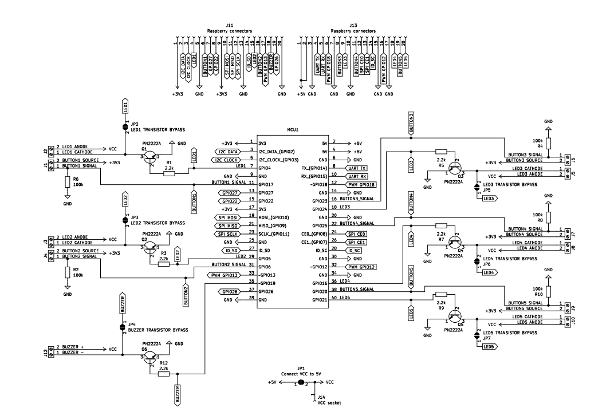
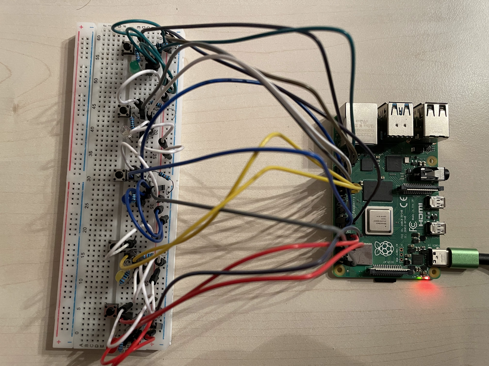

# Raspberry Pi Game Table

## Overview
This project utilizes a Raspberry Pi to power a game table with 5 LEDs and 5 buttons. The main menu allows users to choose games by clicking the corresponding buttons.

## Setup Instructions
1. **Hardware Requirements:**
    - Raspberry Pi
    - 5 LEDs
    - 5 Buttons
    - Wires, Resistors, Transistors
    - Power source (e.g., USB power supply)

2. **Wiring:**
    - Connect the LEDs and buttons to the Raspberry Pi GPIO pins according to the provided pinout or wiring diagram.

4. **Run:**
- To run this project, ssh into you device, clone the repo and run `make run-service`, this will also ensure it will initialize on boot.

4. **Prototype:**

